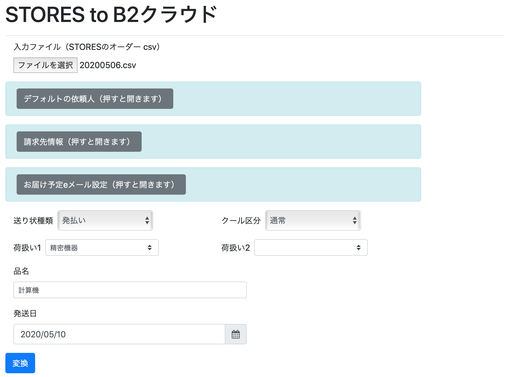

# STORES to B2クラウド

[STORES](https://stores.jp)の[オーダーcsv](https://officialmag.stores.jp/entry/kaigyou/kinou-ordercsv)を、[ヤマト運輸 B2クラウド](http://www.kuronekoyamato.co.jp/ytc/campaign/B2cloud/)の[送り状基本レイアウトcsv](https://bmypage.kuronekoyamato.co.jp/bmypage/pdf//exchange.pdf)に変換します。

現時点では、利用者がWebサーバを設置する必要があります。全ての処理はブラウザ側で行われるので、顧客データがWebに流れる心配がありません。また、ローカルPCのWebサーバでも問題なく動作します。



## 特徴

オーダーcsvからB2クラウドのレイアウト変更は、B2クラウドの紐付け機能でもできますが、このプログラムでは以下のことができます。

* 「依頼主」を原則として事業者に設定するが、STORESの「ギフト」で購入されたものは、購入者が依頼主に設定される。
* STORESのオーダーで「備考」を表示する。「備考」に時間指定などがあった場合、B2クラウド側で指定するときに利用できる。

## ビルド

[リリース](https://github.com/skoji/stores-to-b2cloud/releases)ページから、ビルド済みのzipをダウンロードできます。

node.jsを用意すれば、手元でビルドすることもできます。

``` sh
npm install && npm run build
```

## 設定

`default-data.json`を用意します。`dafault-data-template.json`をもとにしてください。

``` json
{
  "senderZip" : "1000001",
  "senderAddress" : "東京都千代田区千代田1-1-1",
  "senderAddress2" : "山田荘101",
  "senderTel" : "090-1111-1111",
  "senderName" : "山田たろう",
  "customerId" : "1234567890",
  "contentsName" : "計算機",
  "customerKind" : "",
  "fareId" : "01",
  "cool" : 0,
  "sendKind" : 0
}
```

* `sender`で始まる要素は、デフォルトの依頼人です。
* `contentsName`は品名にはいります。（STORESのアイテム名は今は反映させていません）
* `customerId`は、B2クラウドの顧客コードです。
* `customerKind`は、B2クラウドの請求先分類コードです。
* `fareId`は、B2クラウドの運賃管理番号です。
* `cool`はクール便区分です。0：通常 2:クール冷蔵 1:クール冷凍
* `sendKind`は送り状種類です。0 : 発払い 3 : ＤＭ便 4 : タイム 5 : 着払い 7 : ネコポス 8 : 宅急便コンパクト

## 設置

Webサーバ上の適切な場所に、`index.html`、`build/index.js`、`default-data.config`を設置してください。rsyncを使う場合は、`deploy-template.sh`も参考になるでしょう。

## 使い方

ページを開き、「入力ファイル」に、STORESからダウンロードしたオーダーcsvを指定します。その他の設定を必要に応じて変更した上で、「変換」ボタンを押してください。
「B2クラウド用csvダウンロード」のリンクが現れます。STORESオーダーで備考に書かれていることがあれば、その下の領域に表示されます。

ダウンロードしたcsvを「送り状発行システムB2クラウド」の「外部データから発行」で、「基本レイアウト(csv)」を選択した上でアップロードしてください。
「取り込み開始行」は2行目です。

## 利用上の注意点

### オーダーのステータス

* STORESでステータスが「未注文」または「入金待ち」のオーダーを変換します。「入金待ち」のオーダーについては画面上に警告メッセージを表示します。
* 「キャンセル」や「完了」のデータが含まれていた場合は、変換処理全体を行いません。

### 住所情報

STORESの住所情報は、B2クラウドの情報ほど細かく分かれていません。このため、「アパート・マンション名」が正しく抽出できません。
カタカナが2文字以上続く場所から後を「アパート・マンション名」とみなして分割しますが、カタカナではないアパート名などで問題が発生します。

B2クラウドで読み込み後に修正してください。

## 変換後のcsvをExcelで開く

文字コードがUTF-8のため、Excelで直接開くと文字化けします(Numbersでは問題ありません）。もしExcelで開きたい場合は、Excelの「外部データの取り込み」を利用してください。手順は以下の通りです。

1. Excelで新規ファイルを開く。
2. 「データ」タブの「テキストファイル」を押す。
3. csvファイルを指定し、「データ取り出し」を押す。
4. 「元のファイル」のプルダウンメニューで「Unicode（UTF-8)」を選択し、「次へ」を押す。
5. 「区切り文字」で「カンマ」だけを選択する。（「タブ」などのチェックは外す）。「連続した区切り文字は一文字として扱う」のチェックが入っていないことを確認する。「文字列の引用符」は「"」を選ぶ。「「次へ」を押す。
6. 「列のデータ形式」は標準を選ぶ。「完了」を押す。
7. 「OK」を押す。

## ライセンスなど

* [encoding.js](https://github.com/polygonplanet/encoding.js/)を使っています。（encoding.jsの[ライセンスはMIT](https://github.com/polygonplanet/encoding.js/blob/master/LICENSE)です）
* 単純なコードで、改造は簡単だと思います。必要があればforkして変えていってください。
* AGPL3.0であることにご留意ください。万が一別のライセンスをご希望の場合は[skoji@skoji.jp](mailto:skoji@skoji.jp)までお問い合わせください。


